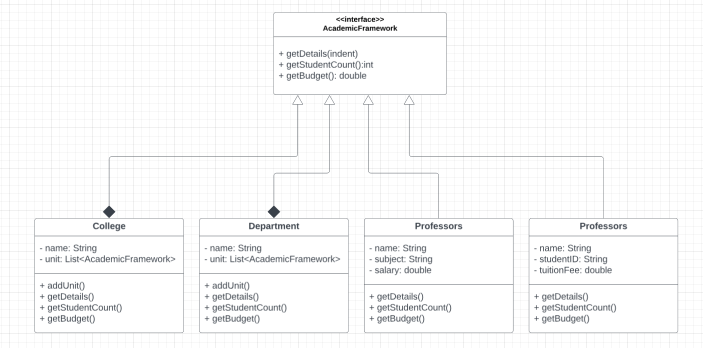

# NEU Organization Structure System

This activity implements a university organizational structure for **New Era University (NEU)** using the **Composite Design Pattern** in Java. It models the hierarchical relationships among Colleges, Departments, Professors, and Students, allowing for structured representation, analysis, and reporting of organizational units.

---

## Objectives

- Represent part-whole relationships within the university (e.g., a College contains Departments, Professors, and Students).
- Demonstrate object-oriented design principles using the Composite Design Pattern.
- Support hierarchical nesting of colleges and departments.
- Provide functionality for:
  - Displaying complete organizational details.
  - Calculating the total number of students in any unit.
  - Computing the total budget (i.e., salaries and tuition contributions).

---

## Features

- **Composite Pattern Implementation**: Allows treatment of both individual entities (Professors, Students) and composite units (Departments, Colleges) uniformly.
- **Detailed Display**: Hierarchically displays college structures, including departments, professors, and students.
- **Budget Calculation**: Calculates the total budget by summing professor salaries and subtracting student tuition fees.
- **Student Count**: Computes total student enrollment at any level of the organization.

---

## Class Structure

- **UniversityUnit (Interface)**  
  Common interface for all organizational entities (College, Department, Professors, Students).

- **College**  
  Can contain multiple departments, students, professors, or other sub-colleges.

- **Department**  
  A subdivision of a college that contains professors and students.

- **Professors**  
  Individual entities with attributes such as name, subject, and salary.

- **Student**  
  Individual entities with name, student ID, and tuition fee.

---

## UML Class Diagram of NEU Organization Structure System (Composite Design Pattern)

